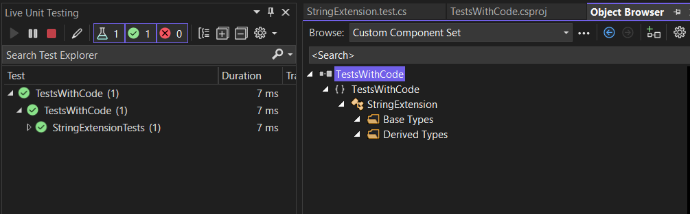

# Extremely simple sample on how to add Unit tests to the same project as the code you wanna test lives.

Here's an example on live unit testing and the object expoler loading the generated library after it has been published with:
`dotnet publish -c Release`
